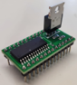
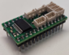
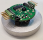
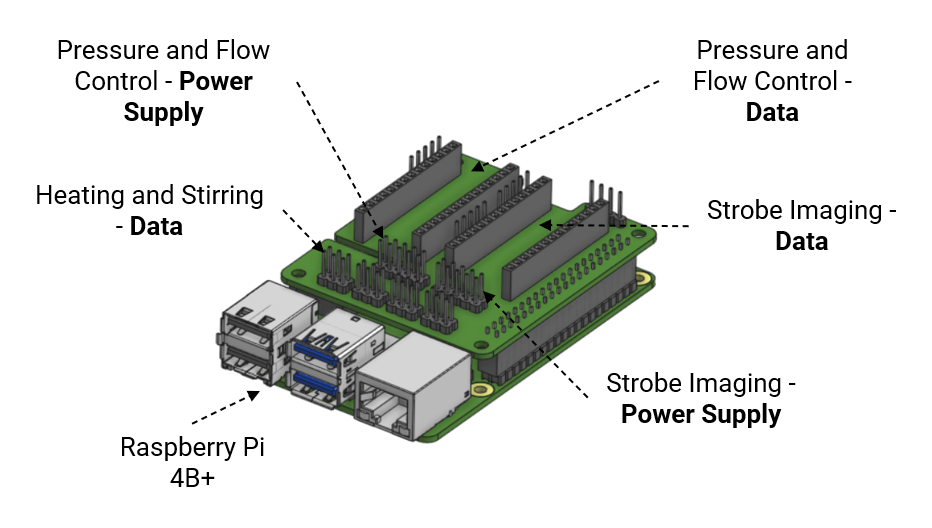
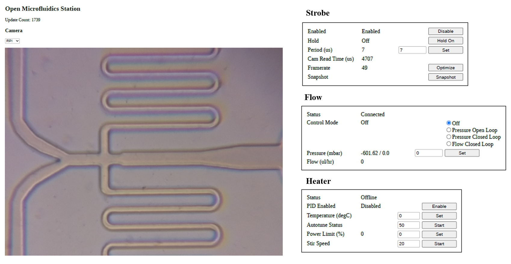

# "Rio" the modular microfluidics controller 

This repository contains the _free_ and _open-source_ designs and documentation for the _core board_ and their _modules_ of a microfluidics workstation to enable _high-throughput droplet microfluidic_ biological assays. The designs contain an electronics board "hat" that plugs onto a Raspberry Pi single-board computer and interfaces with our _compact controllers_ e.g. for gas-pressure control to push microfluidic samples onto chips, pressure, and flow measurement with feedback control, sample holders with heating and stirring, and imaging of fast droplet generation processes with open-source microscopy and stroboscopic illumination.

This is an open, collaborative project by the [Wenzel Lab](https://wenzel-lab.github.io/en/) in Chile, and _your participation_ (comments, inputs, contributions) are explicitly welcome! Please submit your message as an issue in this repository to participate.

Follow us! [#twitter](https://twitter.com/WenzelLab), [#YouTube](https://www.youtube.com/@librehub), [#LinkedIn](https://www.linkedin.com/company/92802424), [#instagram](https://www.instagram.com/wenzellab/), [#Printables](https://www.printables.com/@WenzelLab), [#LIBREhub website](https://librehub.github.io), [#IIBM website](https://ingenieriabiologicaymedica.uc.cl/en/people/faculty/821-tobias-wenzel)

## Table of contents ##

- [Why Rio](#why-rio)
- [Getting Started](#getting-started)
- [Use Cases](#use-cases)
- [Read the Paper](#read-the-paper)
- [Modules Wish List](#modules-wish-list)
- [Contributing](#contributing)
- [License](#license)

## Why "Rio" ##

Our aim is to create a prototype of a _compact_ working station for microfluidic research that is based on _connectable_, _open_, modern, and _low-cost_ components (Rasberry Pi, Arduino, 3D printing, on-board components, open or at least accessible design software and operation software - python).

**Rio** serves as a platform to implement fully functional research-grade workstations with good specifications, such as fast reaction times and low-pressure fluctuations. It is modular so that parts of this platform can be repurposed and improved in the open-source hardware sense and easily combined, exchanged, or used independently in challenging environments.

## Getting Started ##

### Core Board and Modules

A _module_ commonly consists of a compact controller, sensors, and actuators, and operates with distinct power supply and data connections. The controllers convert physical data into digital data, manipulate the actuators, and supply energy to external components. 

<table>
<tr>
    <td align="center"><b>Strobe Imaging Module</b></td>
    <td align="center"><b>Pressure and Flow Control Module</b></td>
    <td align="center"><b>Heat and Stirring Module</b></td>
</tr>
<tr>
    <td align="center"></td>
    <td align="center"></td>
    <td align="center"></td>
</tr>
<tr>
    <td align="center"><a href=https://github.com/wenzel-lab/modular-microfluidics-workstation-controller/tree/documentation/beta/module-strobe-imaging> <b>Build the controller</b></a>  </td>
    <td align="center"><a href=https://github.com/wenzel-lab/modular-microfluidics-workstation-controller/tree/documentation/beta/module-pressure-and-flow-control> <b>Build the controller</b></a>  </td>
    <td align="center"><a href=https://github.com/wenzel-lab/modular-microfluidics-workstation-controller/tree/documentation/beta/module-heating-and-stirring> <b>Build the controller</b></a>  </td>
</tr>
</table>

The core board consists of a Raspberry Pi 4B+ and a custom Pi HAT (hardware attached to the top). The Pi HAT is an extension board for bidirectional communication and power supply to the controllers. 

<table>
<tr>
    <td align="center"><b>Core Board</b></td>
</tr>
<tr>
    <td align="center">
</tr>
    <td align="center"><a href=https://github.com/wenzel-lab/modular-microfluidics-workstation-controller/tree/documentation/beta/RPi-HAT-extension-board> <b>Build the Pi HAT</b></a>  </td>
</tr>
</table>

### Software

The software follows a client-server architecture and allows users to control the physical hardware through a graphical interface. It runs on a Raspberry Pi 32-bit operating system.

<table>
<tr>
    <td align="center"><b>Web UI</b></td>
</tr>
<tr>
    <td align="center"></td>
</tr>
<tr>
    <td align="center"><a href=https://github.com/wenzel-lab/modular-microfluidics-workstation-controller/tree/documentation/beta/user-interface-software> <b>Source Code</b></a>  </td>
</tr>
</table>

## Use Cases ##

Single-module solution:
* Strobe-enhanced microscopy stage ( [Repository](https://github.com/wenzel-lab/strobe-enhanced-microscopy-stage) | [Assembly Instructions](https://wenzel-lab.github.io/strobe-enhanced-microscopy-stage/) )

Three-modules solution:
* Flow microscopy platform ( [Repository](https://github.com/wenzel-lab/flow-microscopy-platform) | Assembly Instructions (Soon) )

## Read the Paper ##

"Rio" has been employed in the article ["Plasmid Stability Analysis with Open-Source Droplet Microfluidics"](https://app.jove.com/t/67659/plasmid-stability-analysis-with-open-source-droplet-microfluidics), published in JoVE in December 2024.

DOI: [https://dx.doi.org/10.3791/67659](https://dx.doi.org/10.3791/67659)

## Modules Wish List ##

* High-pressure source module.
* Anaerobic chamber module (this module might have its own repository).
* Microfluidic droplet sorting workstation driven by the droplet workstation tools is described [here](https://github.com/MakerTobey/Open_FPGA_control_for_FADS) (This is being developed in a separate repository).

> **Please Note:** There is also a previous general [open-source microfluidics repository](https://github.com/MakerTobey/OpenMicrofluidics) with re-builds and design considerations. 

## Contributing ##

Feel free to dive in! [Open an issue](https://github.com/wenzel-lab/moldular-microfluidics-workstation-controller/issues/new).
For interactions in our team and with the community applies the [GOSH Code of Conduct](https://openhardware.science/gosh-2017/gosh-code-of-conduct/).

## License ##

**Hardware:** All source files located in the `electronics` directories are released under the [CERN-OHL-W-2.0](https://ohwr.org/cern_ohl_w_v2.txt) license.

**Software:** The source codes located in the `user-interface-software/src/webapp` and `firmware` directories are released under the [GPL-3.0](https://www.gnu.org/licenses/gpl-3.0.en.html) license.

**Other materials:** All other materials, including instructions and pictures, are released under the [Creative Commons CC-BY-SA 4.0](https://creativecommons.org/licenses/by-sa/4.0/) license.

© Tobias Wenzel, Christie Nel, and Pierre Padilla-Huamantinco. This project is Open-Source Hardware - please acknowledge us when using the hardware or sharing modifications.