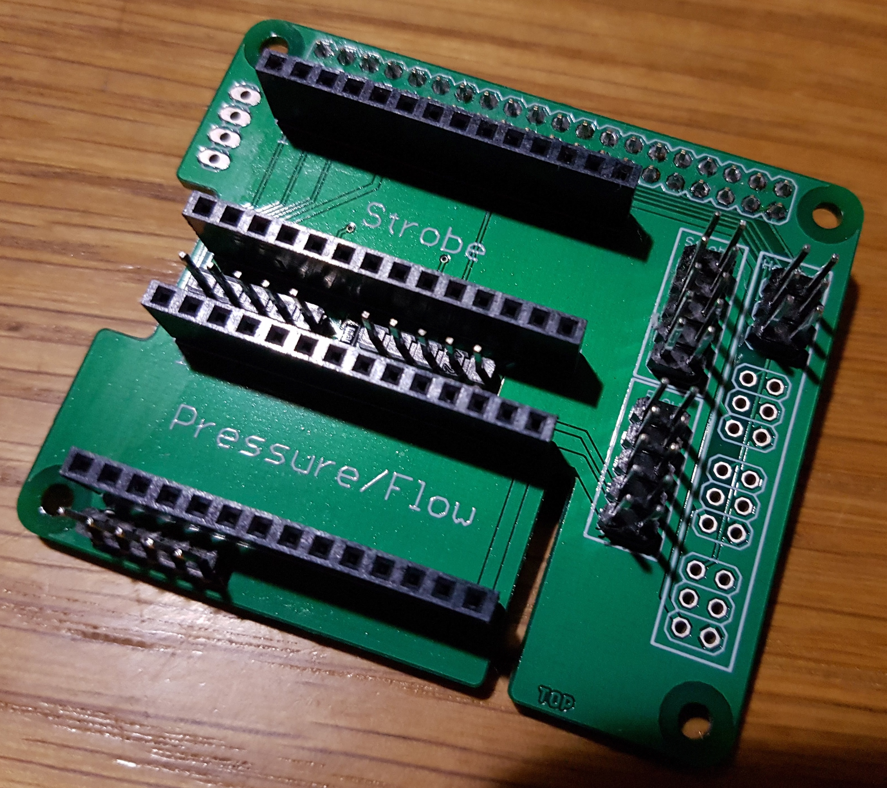
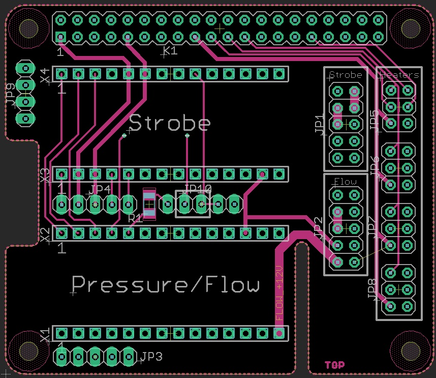
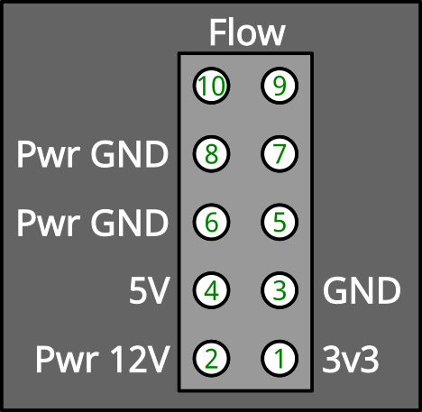
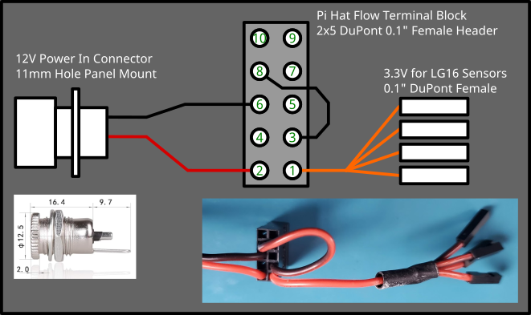

## Raspberry Pi Hat

The Pi HAT (hardware attached on top), an expansion board, helps to physically connect the Raspberry Pi board with modules for bi-directional communication and supply current to the actuators.

   

### Connectors

The Pi Hat features * connectors.

#### Flow Module Power Connector

This is a 2x5 standard DuPont male header.

#### Cable for Flow Module Power Connector

