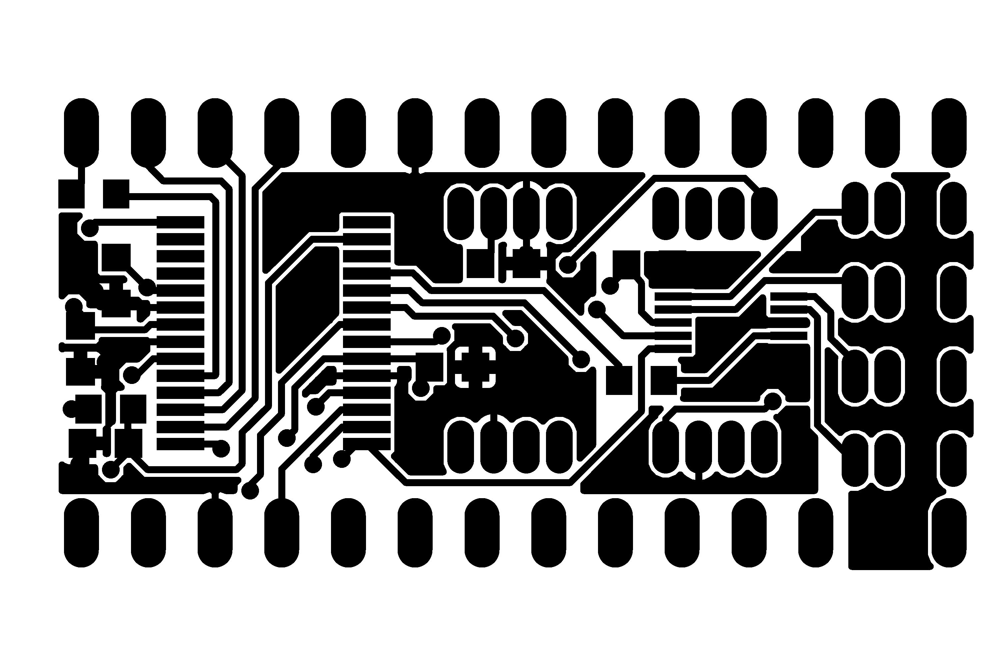

## Pressure and flow controller module

This is the core piece of the workstation. 
This electronic controller module aims to regulate and distrbute the pressure (originating from the pressure source module) into the sample tubes, so that the samples (aqueous, gel pre-cursors and oils) flow onto the microfluidic chip and the collection reservoirs.
We aim to regulate pressures enough for ultra-high throughput agarose bead generation (several bar), in a smooth fashion that avoids pulsing, especially at steady state.
This controller consists of a custom circuit board that plugs into the Raspberry Pi hat, in addition to connectors for connecting external pressure controllers and flow sensors. Pressure and flow control are fully automatic.

The controller module can operate either in pressure control mode or flow control mode.  Flow control mode requires external flow sensors to be connected.  Once desired flow rates have been achieved and associated pressures are known, the experiment can be reproduced using only pressure control, without the need for expensive flow sensors.  Both modes require external pressure controllers to be connected.

The module contains a PIC microcontroller that communicates with the Raspberry Pi, controls the pressure controllers and reads back pressure and flow.  The pressure target is controlled using a digital-to-analogue converter and the actual pressure is read using an analogue-to-digital converter.  The flow controllers is read via a four channel I2C multiplexer.

### Pressure Controllers
We have selected the SMC ITV0010 pressure controllers for this application.  The pressure target is supplied to the pressure controller by the module as an analogue voltage and the measured pressure achieved is returned as an analogue voltage.  This approach allows the option to connect alternative analogue pressure controllers, or using a separate pressure sensor instead of the one internal to the pressure controller.

The ITV0010 pressure controllers can be purchased as a compact DIN-mounted manifold block that requires a single pressure supply line.

### Flow Sensors
We have selected the Sensirion LG16 range of flow sensor.  They feature a digital interface via I2C.

### Connectors

The module features eight Picoblade connectors.  Four connect to the pressure controllers, carrying power, analogue out and analogue in.  The other four connect to the optional flow sensors and carry power and I2C signals.  The module itself is designed to plug into the Raspberry Pi hat.  This allows for power and digital communications with the Raspberry Pi.

#### Pressure Controller Connector

|Pin|Description|
|-|-|
|1|Pressure In|
|2|Pressure Out|
|3|0V Power / GND|
|4|12V Power|

#### Flow Sensor Connector

|Pin|Description|
|-|-|
|1|I2C Data|
|2|Vdd 3.3V|
|3|Vss (Digital Ground)|
|4|I2C Clock|

**Note:** Pin 2 (Vdd 3.3V) must not be used to power Sensirion LG16 sensors, which require 5V.  This 3.3V pin was intended for use with the Sensirion SLF3S-1300F.  Instead use the 5V pin on the Controller Module header block on the Raspberry Pi hat.

### Pinout

|Pin|Description|
|-|-|
|1|ICSP MCLR|
|2|ICSP Vdd (3V3 Power)|
|3|ICSP Vss (Digital Ground)|
|4|ICSP Data|
|5|ICSP Clock|
|13|Ground for 12V|
|14|12V Supply for Pressure Controllers|
|17|5V Digital Power|
|23|Digital Ground|
|24|Digital 3.3V Power|
|25|SPI Slave Select|
|26|SPI Clock|
|27|SPI MOSI|
|28|SPI MISO|

**Note:** Pin 13 (12V Ground) must be connected with pin 23 (digital ground) externally, and in a way that prevents ground loops.

### PCB Components

|Qty|Name|Component|Description|
|-|-|-|-|
|7|C1-C5,C8-C9|100nf Capacitor 0603|Decoupling Capacitors|
|2|C6,C10|10uF Capacitor 0603|Bypass,Bulk Capacitor|
|1|C7|Not fitted||
|1|IC2|dsPIC33CK256MP502-I/SS SSOP28|PIC Microprocessor|
|1|IC3|AD5624R|DAC|
|1|IC4|ADS1115|ADC|
|1|IC5|PCA9544APW,112|I2C Multiplexer|
|1|IC6|25AA040ST|EEPROM|
|12|R1-R10,R12-R13|1k Resistor 0603||
|1|R11|10k Resistor 0603||
|8|X1-X8|Picoblade 53047-0410|Connectors|

Please note that our current implementation is based on compact, low-cost and scalable PIC microcontrollers that fit onto the Pi-hat modules. These cannot simply be programmed with a micro-USB cables. Instead, they need an [additional small hardware ICSP interface](https://www.digikey.com/en/product-highlight/m/microchip-technology/pickit-3-in-circuit-debugger-programmer) (or equivalent) to load new code onto the PIC microcontrollers.

### Cable for Sensirion LG16

Flow Controller Module End

Connector Type: Picoblade 1.25mm 4-way (51021-0400) 
Connector Crimps: Picoblade 26-28 AWG (50079-8000)

|Pin|Wire|Function|
|-|-|-|
|1|1|I2C Data|
|2|-|Not Connected|
|3|3|VSS|
|4|4|I2C Clock|

Connector Type: DuPont Standard Female

|Pin|Wire|Function|
|-|-|-|
|1|2|VDD 5V|

Flow Sensor End (Sensirion LG16)

Connector Type: Picoblade 1.25mm 5-way (51021-0500) 
Connector Crimps: Picoblade 26-28 AWG (50079-8000)

|Pin|Wire|Function|
|-|-|-|
|1|1|I2C Data|
|2|4|I2C Clock|
|3|2|VDD 5V|
|4|3|VSS|
|5|-|Not Connected|

### Cable for SMC ITV Electro-Pneumatic Regulator

This cable was purchased from bpx.co.uk and a Picoblade connector fitted, which plugs into the Flow Controller Module.  The wires are too thick to fit directly into the crimps, so thinner wires must be soldered onto the cable.

Cable: M84DSX3MG4 
Connector Type: Picoblade 1.25mm 4-way (51021-0400) 
Connector Crimps: Picoblade 26-28 AWG (50079-8000)

|Pin|Colour|Function|
|-|-|-|
|1|Black|Input Signal|
|2|White|Monitor Output|
|3|Blue|GND (Common)|
|4|Brown|Power|
