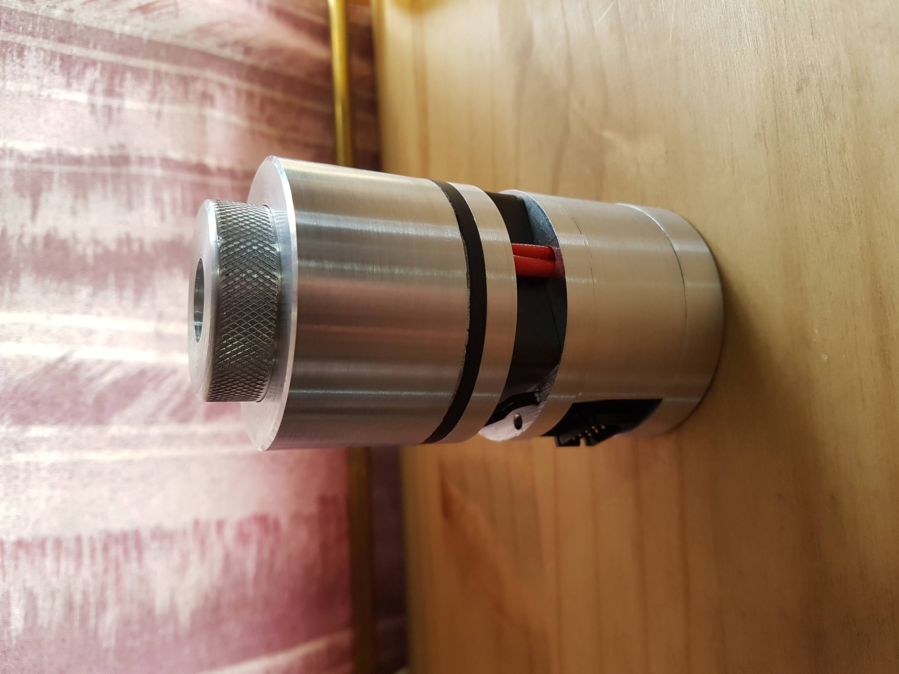
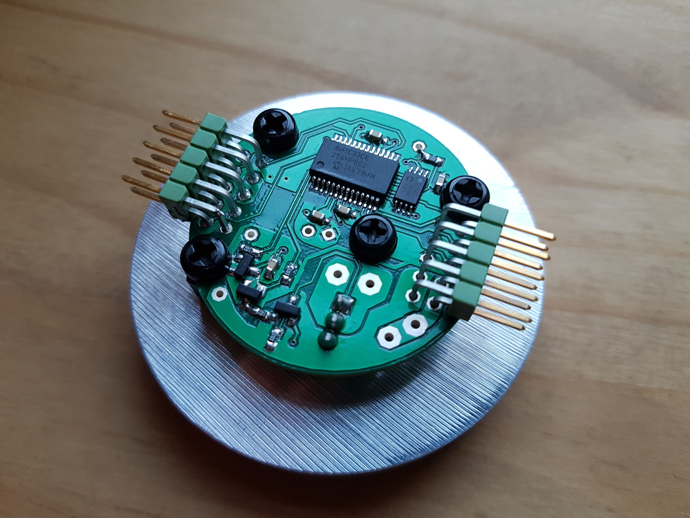
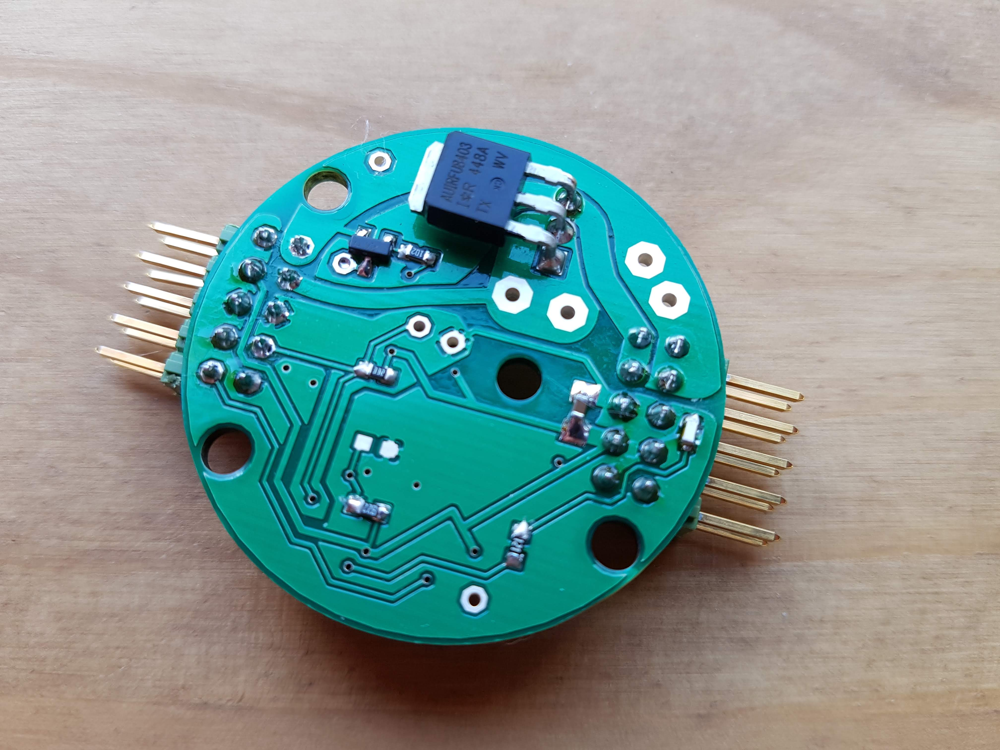
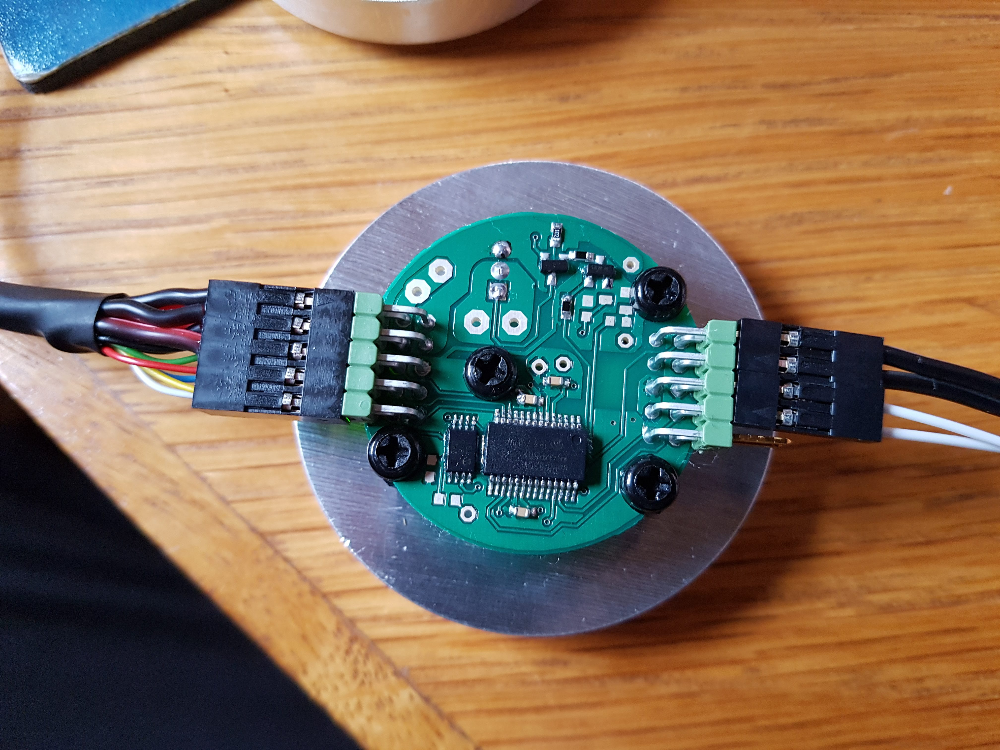
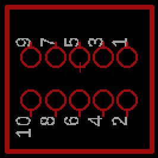
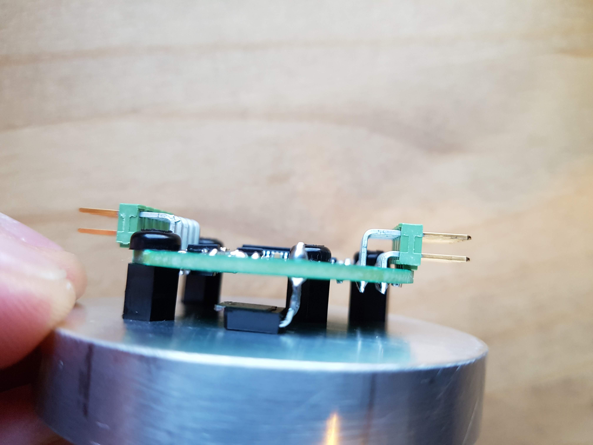
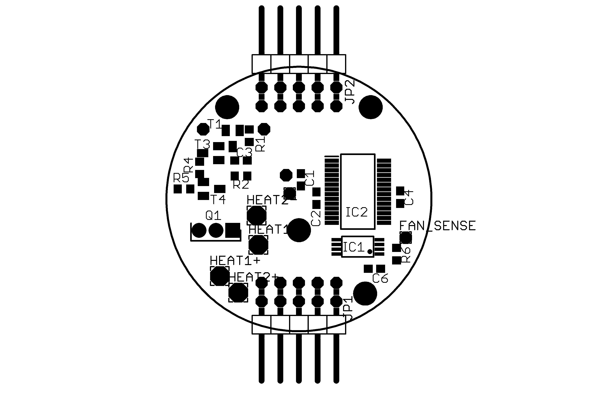
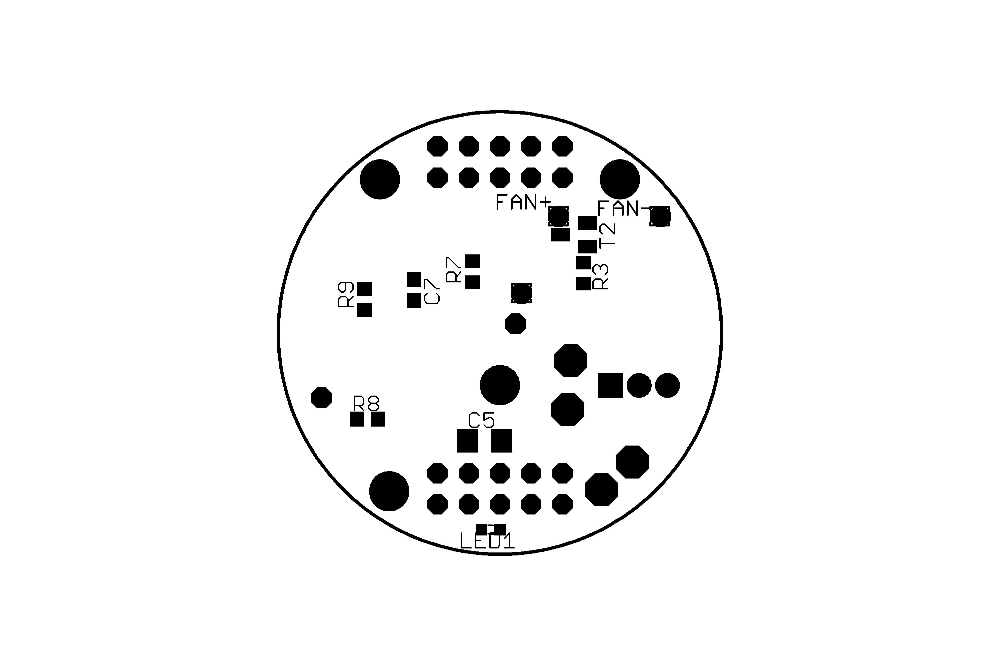
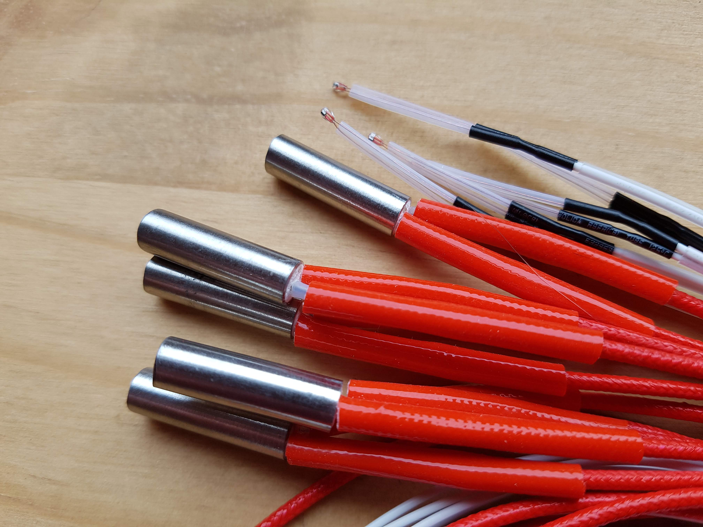
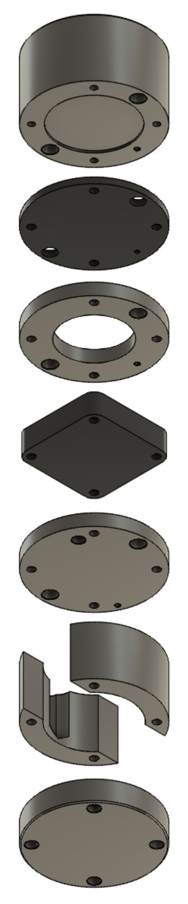

# Sample Holder Module

The sample holder is used to heat microfluidic sample liquids such as water, oil or agarose to a set temperature and optionally stirring the sample using a magnetic stir bar, before pumping it through a microfluidics chip.  The PCB can also be used separately with external heaters to heat tubing or microscope glass slides.

The sample holder module comprises a PCB, two cartridge heaters, temperature sensor and stirring motor and magnets, all integrated into an aluminium shell.  Aluminium inserts that slot into the top can be machined to accommodate sample bottles of various shapes and sizes.  The sample holder connects to a Raspberry Pi via SPI, from which the sample holder temperature and stir speed are set and monitored.

The sample holder has been tested to 100 degrees Celcius and provides a stable (but uncalibrated) readout to 0.01 degrees Celcius.

## PCB

The sample holder PCB is the heart of the sample holder and contains a PIC microprocessor that reads the temperature sensor, controls the heaters and stirrer motor and offers an SPI interface to a host.

The PCB has been designed for dual use.  It can be mounted in a sample holder with heaters, temperature sensor and stir motor wires soldered to the PCB.  Alternatively, it can also be used with external heater and temperature sensor attached via the secondary connector as shown below.

The connector on the left is the primary connector and provides 12V power for the heaters, 3.3V power for the microprocessor and SPI communications with the Raspberry Pi.

The connector on the right is the secondary connector that connects to the external heater (black wires) and temperature sensor (white wires).  The polarity of heater and temperature sensor does not matter.  The connector also provides debug serial output and ICSP interface for reprogramming the PIC microprocessor.

### PCB Primary Connector : Power and SPI Interface

|Pin|Description|
|-|-|
|1|SPI Clock|
|2|SPI Slave Select|
|3|Vdd 3.3V|
|4|SPI MOSI|
|5|Vss (Digital Ground)|
|6|SPI MISO|
|7|Heater 0V|
|8|Heater 12V|
|9|Heater 0V|
|10|Heater 12V|

**Note:** Vss(GND) must be connected with Heater 0V, and in a way that prevents ground loops.

### PCB Secondary Connector : External Heater, Temperature Sensor, Debug Serial and Programming Interface (ICSP)

|Pin|Description|
|-|-|
|1|Heater Out 12V|
|2|ICSP MCLR|
|3|Heater Out 0V|
|4|ICSP 3.3V|
|5|Temp Sensor (Vss)|
|6|ICSP GND (Vss)|
|7|Temp Sensor +|
|8|ICSP PGD|
|9|Serial Debug TX|
|10|ICSP PGC|

**Note:** Do not supply ICSP 3.3V while also supplying Vdd 3.3V as they are connected.

### PCB FET Mounting

A power FET is mounted on the bottom of the PCB and drives the heaters.  It is intended to touch the metal the PCB is mounted on, with thermal paste between FET and metal.

### PCB Components

|Qty|Name|Component|Description|
|-|-|-|-|
|1|IC2|dsPIC33CK256MP502-I/SS SSOP28|PIC Microprocessor|
|1|IC1|25AA128-I/ST TSSOP8|SPI EEPROM|
|1|Q1|AUIRFU8403 IPAK|MOSFET|
|2|T1,T3|MMBT3904LT1 SOT23|NPN Transistor|
|2|T2,T4|MMBT3906LT1 SOT23|PNP Transistor|
|1|LED1|LTST-S270KGKT 0603|Green Side View LED|
|2|J1,J2|10 Pin 2 Row Angled Header||
|1|R7|3.3k Resistor|Temperature Sensor Reference|
|6|R1-R6|1k Resistor 0603||
|1|R9|10k Resistor 0603|PIC MCLR Pull Up|
|1|R8|120R Resistor 0603|LED Resistor|
|4|C1,C2,C4,C6|100nf Capacitor 0603|Decoupling Capacitors|
|1|C3|1nf Capacitor 0603|Motor Drive Capacitor|
|1|C5|10uf Capacitor 1206|Bulk Capacitor|

Please note that our current implementation is based on compact, low-cost and scalable PIC microcontrollers that fit onto the Pi-hat modules. These cannot simply be programmed with a micro-USB cables. Instead, they need an [additional small hardware ICSP interface](https://www.digikey.com/en/product-highlight/m/microchip-technology/pickit-3-in-circuit-debugger-programmer) (or equivalent) to load new code onto the PIC microcontrollers.  

## Heaters and Sensors

The heaters are 3.3 Ohm (rated 12V, 40W) stainless steel cartridges that insert into holes drilled into the top section of the sample holder.  A temperature sensor is inserted into a hole drilled into the same section.  The temperature sensor is a negative coefficient thermister (NTC).  These heaters and temperature sensors are commonly used in 3D printers and can be found on eBay or Amazon.

## Stirrer Motor and Magnets

The stirrer motor rotates two attached magnets, which in turn rotate an optional stirrer magnet in the sample bottle inserted into the top of the sample holder.

The stirrer motor is a standard 40mm x 40mm x 10mm, three wire fan.  The rotating side points upward and has two 6mm diameter x 2mm thick Neodymium magnets mounted flat next to each other (opposing poles same side) in the centre of the fan.  The magnets have to be raised off the fan such that their fields do not interfere with the operation of the fan, be close enough to the stirrer magnet, while not touching the opposing surface.  We find that raising it 3-4mm with layers of double sided tape is sufficient and provides enough strength to spin the stirrer magnet.  The fan wire colours are typically black=ground, red=12V, yellow=sense/tachometer.

## Power Considerations

The heaters can draw quite a lot of power, so an adequate 12V power supply must be provided.  At full power with two 3.3 Ohm heaters, the required current can be calculated as:
I = ( 12V / 3.3 Ohm ) * 2 heaters = 7.3A
The maximum power can be limited by storing a power limit percentage to the sample holder via SPI.  Alternatively, these 40W heater cartridges are also made for 24V, which have around 4x the resistance (P=V^2/R, 40=24^2/R, R=14.4 Ohm) and will thus consume 1/4 as much power, but heat more slowly.

## Mechanical Design

The sample holder is constructed from layers of machined 54mm diameter aluminium rod as listed in the table below.  The overall dimensions and screw locations are determined by the 40mm fan used as a stir motor.

|Section|Description|
|---|---|
|Top|The top section houses the two heater cartridges and temperature sensor and is the part that gets hot.  It also houses an insert that is shaped to fit a particular sample vessel.|
|Insulation|A layer of FR4 material that insulates the heated top from the rest of the module.|
|Magnet Space|A cavity above the motor/fan where the stir magnets rotate.|
|Motor|The stir motor that rotates the stir magnets.|
|PCB Mount|The plate that the PCB is mounted on with standoffs.  This plate also used as a heatsink for the FET that protrudes from the PCB.|
|PCB Spacer|The cavity for the PCB and wires.|
|Bottom|The bottom plate that closes up the PCB cavity and also holds the screw heads.|

[Download Mechanical Design PDF](doc/sample_holder_design.pdf)
