# Strobe Imaging Module

Stroboscopic imaging is an interesting technique that ‘freezes’ the motion of fast-moving objects. The light source needs to be synchronized with the objects to be inspected, and the camera is triggered at the exact moment of the light pulse. 

The _**Strobe Imaging Module**_ integrates a controller, sensor, and actuator for imaging fast processes, particularly developed for microfluidic droplet generation.

* The _sensor_ is a Raspberry Pi camera V2, a CMOS sensor with an 8-megapixel resolution. If higher technical specifications are required, the module is compatible with the MAKO U-029 high-speed camera.
* The _actuator_ consists of a high-power LED attached to a heat sink and assembled with a condenser lens to transmit light through the samples, which is collected by the _sensor_.
* The _controller_ is a PIC microcontroller board that handles the instant activation of the _actuator_ to capture sharp images of fast moving objects with the _sensor_. It activates the _actuator_ at a specific frequency, defined by the frame rate and exposure time of the _sensor_.

## Features

* High-intensity stroboscopic illumination.
* Two optical configurations: low-cost (Pi lens) and RMS (standard objetives) versions.
* Compatible with industrial high-speed cameras.
* Open-source firmware

## Manufacturing and Assembly

### 1. [Bill of Materials](Bill-of-Materials.csv)

### 2. Required Tools:

<strong>For assembly</strong>

* Crimper
* Needle-nose plier
* Precision wire cutter
* Soldering iron (with fine tip)
* Soldering wire
* Flux
* Tweezer
* Magnifying tool
* PCB holder or third hand
* Multimeter
* Optional: Soldering paste, tip cleaner, desoldering pump, hot air rework station

<strong>For programming</strong>

* MPLAB X IDE v6.10
* XC8 compiler
* USB Drivers of PIC programmer
* PICkit3 programmer (Microchip)
* Mini USB to USB cable
* [Programming cable]() (to connect the PIC programmer to the strobe controller)

### 3. Programming of Controller:

<strong>STEP 1: Physical Connection</strong>

Connect the [programming cable]() to the PIC programmer. The green wire would connect to the pin with the white label.

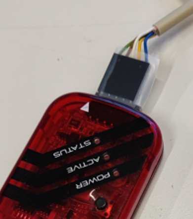

The other end of the cable connects to the first five pins on the controller, which are the five bottom-left pins as seen from above.

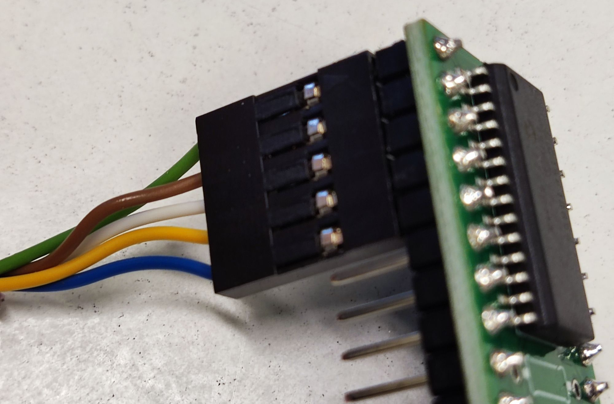

The green wire would connect to the bottom left pin. There should also be a marking on the cable connector by the green wire to confirm it is pin 1.  Please do take care to plug it in the right way.

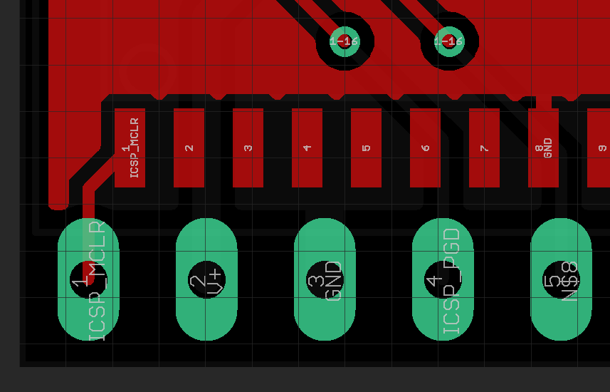

The controller pins are not mapped one-to-one to the chip. You can plug the cable straight onto the controller pins - no need for jumpers.

Color Cable | Programmer Pin | PIC Pin |
------------|----------------|---------|
Green       | MCRL           | PIN 1 (MCLR) |
Brown       | VDD            | PIN 20 (VDD) |
White       | GND/VSS        | PIN 8 (VSS) |
Orange      | PGD            | PIN 28 (ICSPDAT) |
Blue        | PGC            | PIN 27 (ICSPCLK) |

<strong>STEP 2: PIC programming</strong>

You will have to download MPLAB X, which might take a while. Then, open the [strobe_pic project](firmware/) in MPLAB X.

Around the top left of MPLAB X, you will see a box where you can select different configurations. Select the **PICkit3** configuration.

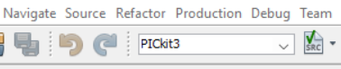

Under the **Projects** tab, right click on the [strobe_pic project](firmware/) and select **Properties**.

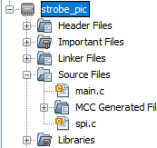

On the top right, change the device to **PIC16F18856**.

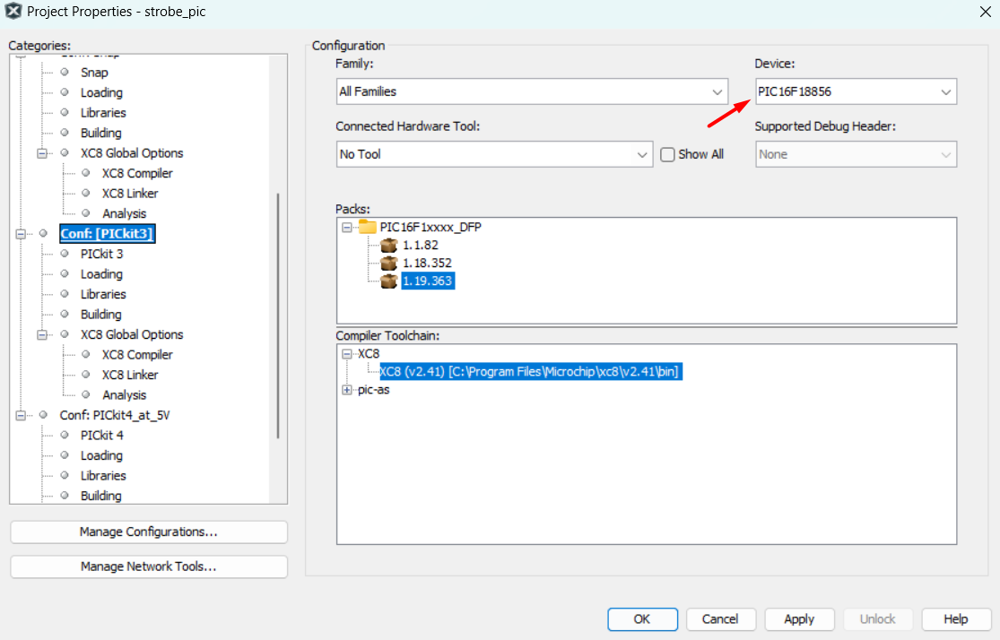

The next step is important. If you plug straight into the controller, the PICkit3 programmer needs to provide power to it. Under **Conf: PICkit3**, select **PICkit 3**.  Under **Option categories:** select **Power** and check the box. Press OK.

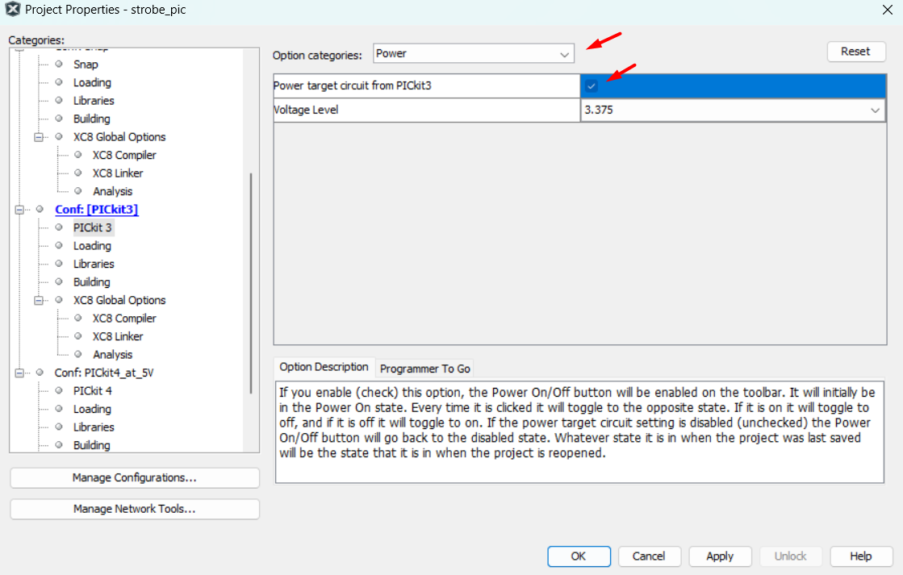

Click the "Clean and Build" button.

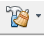

If the configuration is correct, MPLAB X will report **BUILD SUCCESSFUL** in the text box at the bottom.

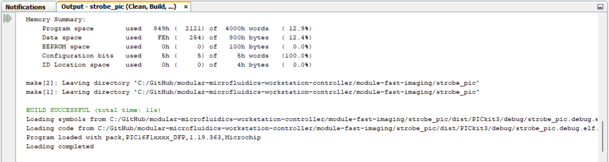

Make sure everything is connected. Use the Mini USB to USB cable to connect the PIC programmer with the computer.

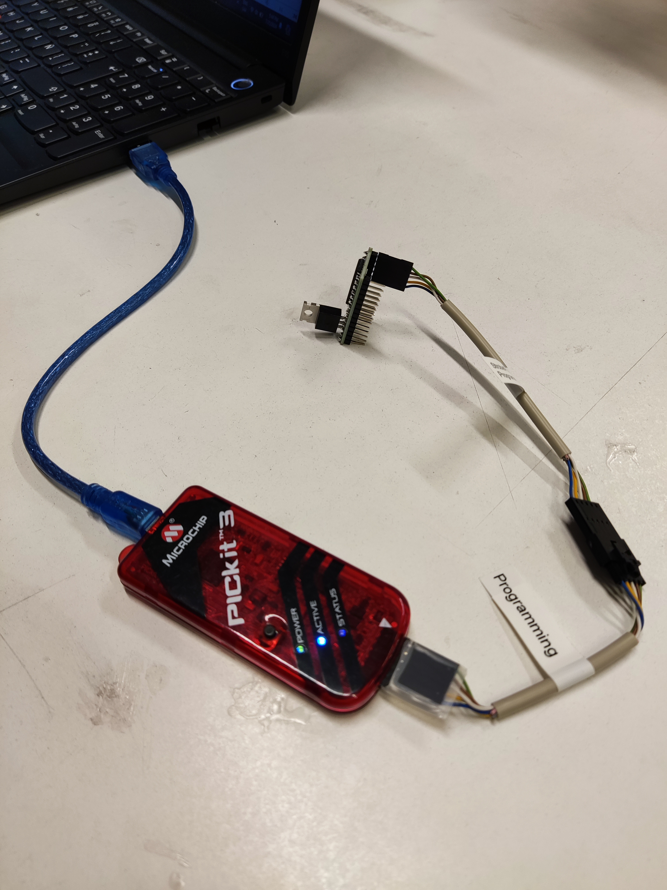

Click the **Program** button.

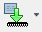

It might ask you to select the PICkit3 and might then download the latest firmware to it.

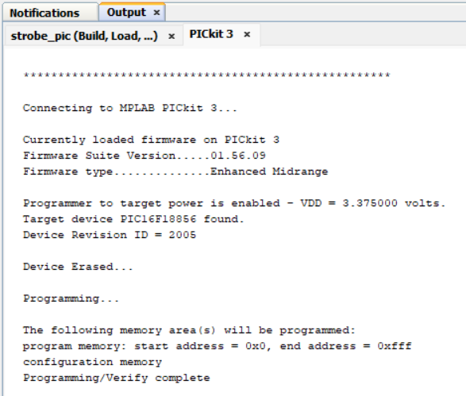

If it says something about reading the wrong ID from the PIC, something is wrong with your connections or soldering (ID 0x0000 or 0xFFFF) or you have a different PIC (if a different ID).

### 4. Assembly of Sensor:

### 5. Assembly of Actuator:

### 6. Assembly of Custom Cables:

<strong>Programming cable</strong>

<strong>Strobe cable</strong>

## Usage

### Requirements

* The core board (a Raspberry Pi 4B+ and the [Pi HAT]()) with the [user interface software]()
* Computer peripherals: monitor, keyboard, and mouse 
* 5V/3A power supply
* Power splitter cable (to supply power to the core board and actuator)
* Voltage regulator (the actuator works with 3V) 

### Schematic of a single-module setup

In the figure below, the schematic representation shows the module, the core board, and (A) low-cost and (B) RMS optical configurations.   

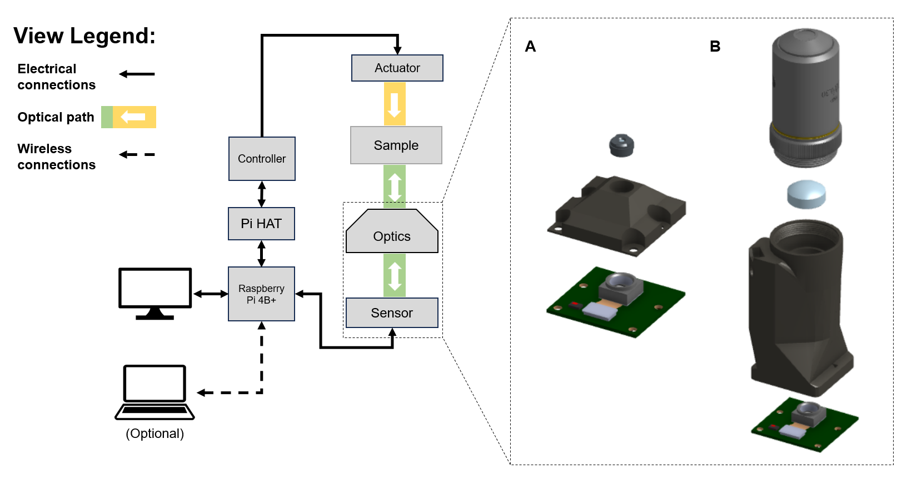

### Use case

The _Strobe Imaging Module_ has been employed in the implementation of a strobe-enhanced microscopy stage for training and research ( [Repository](https://github.com/wenzel-lab/strobe-enhanced-microscopy-stage) | [Assembly Instructions](https://wenzel-lab.github.io/strobe-enhanced-microscopy-stage/) ).

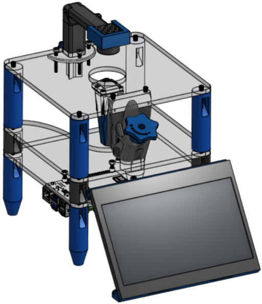

## Results

**1. Microchannels visualization:**
By using the lens of the Raspberry Pi camera (A), the module presents a 1 mm field of view (FOV) with a working distance of approximately 5 mm. The magnification of this optical configuration is comparable to a 4X objective (B), offering a broad FOV to monitor channel behavior, flow patterns, or droplet generation. 

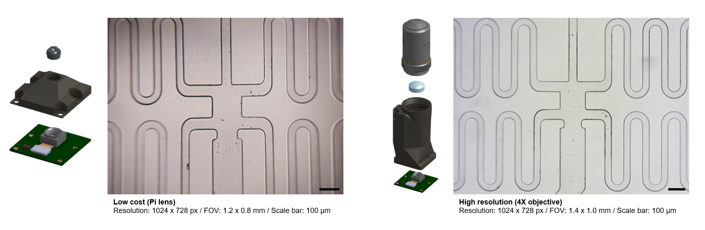

 

**2. Droplet generation in a microfluidic chip (Objective: 4X):**
The image below shows (A) sequential images captured at different stages of droplet formation using the module to verify imaging capabilities for monitoring droplet generation. (B) By zooming in a section of the microfluidic channel, droplets can be easily distinguished from the surrounding oil and qualitatively verify the uniformity in droplet size. The intensity plot demonstrates it showing a consistent drop in grayscale values within the droplet boundary.

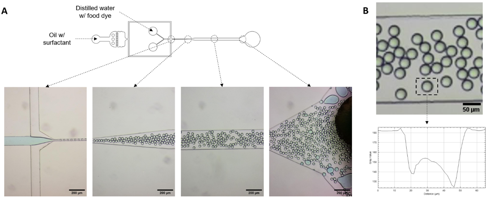

 

**3. Static and moving droplets (Objective: 4X):**
Water-in-oil droplets were generated under varying continuous phase (Qc) and dispersed phase (Qd) flow rates and imaged with the module. Droplet size and uniformity can be monitored as well as droplet generation dynamics. 

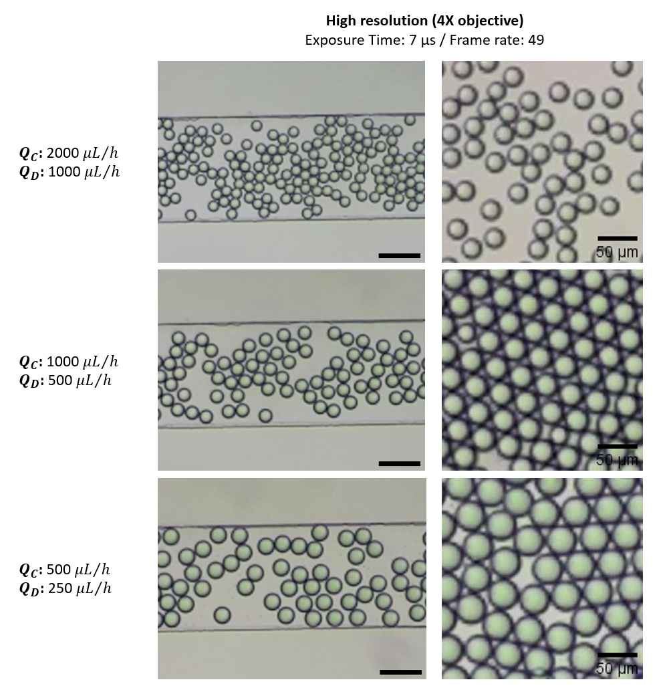

 

**4. Droplet generation and droplet splitting (Objective: 4X)**

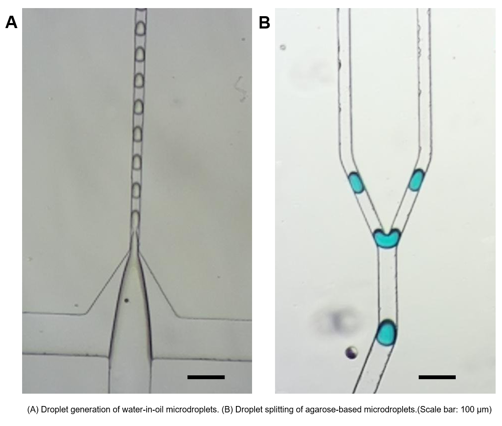