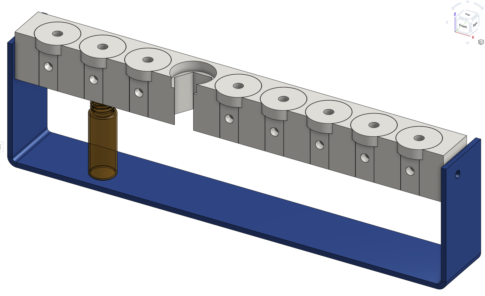

# Sample reservoirs with pressure and sample tubing manifold caps

For 4ml autosampler vial sample reservoirs, 3D designs and drawings [freely accessible on OnShape](https://cad.onshape.com/documents/7c16a4f893c59727774109a0/w/9516d6a2785e29d4604fe688/e/f9cb2954096b3515ac6188b6)

 

For 100ml high-pressure Duran glass bottles

