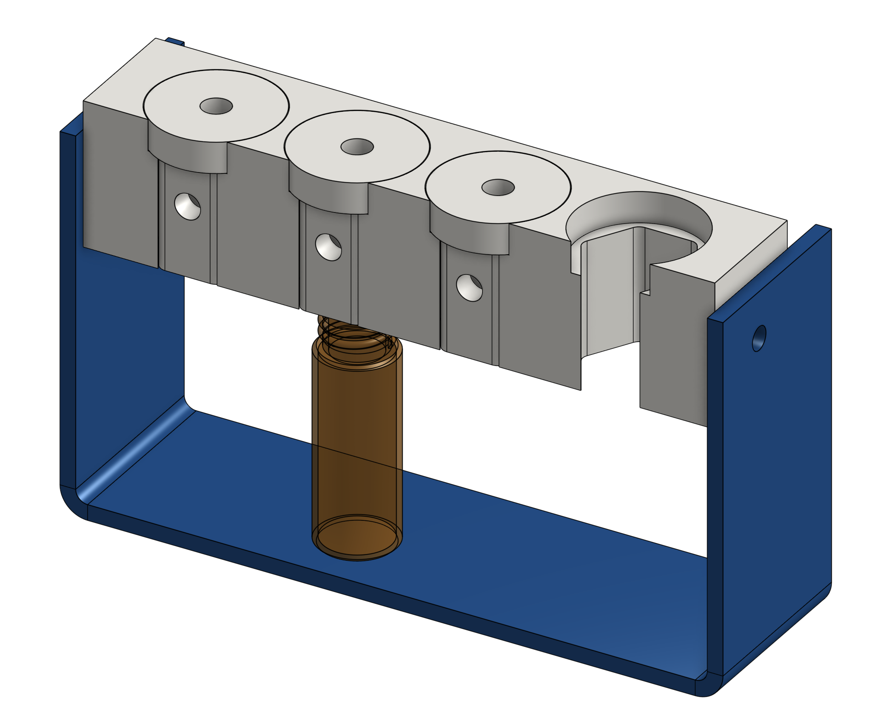
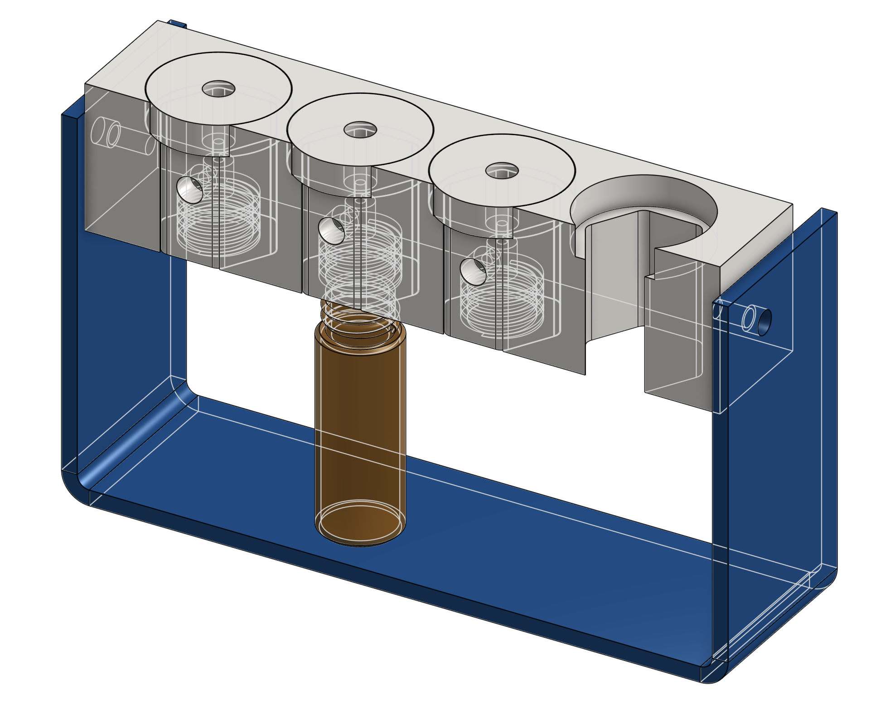

# Modular pressure vial holder with manifold caps

We present a modular sample holder that integrates a parametric CAD design developed [freely accessible on OnShape](https://cad.onshape.com/documents/7c16a4f893c59727774109a0/w/9516d6a2785e29d4604fe688/e/f9cb2954096b3515ac6188b6) 

This sample holder serves as a rack and screw cap for 4ml autosampler vials, small glass bottles often used in laboratories. The hexagonal-shaped caps are designed to facilitate the connection of both microfluidic tubing and a pressure source, enabling easy and precise sample management. This system is an alternative to syringe pumps.

Created with a CNC cutting process using Delrin, a pressure robust, sterilisable and machinable plastic, this holder provides a do-it-yourself solution for producing microfluidic sample reservoirs. These reservoirs can be utilised with a pressure control system to accurately manage the flow of liquids such as chemical substances and biological samples, e.g. cell suspensions. This system is a reliable, practical solution for efficient liquid handling and precise flow control in the laboratory setting. 

 

For 100ml high-pressure Duran glass bottles

